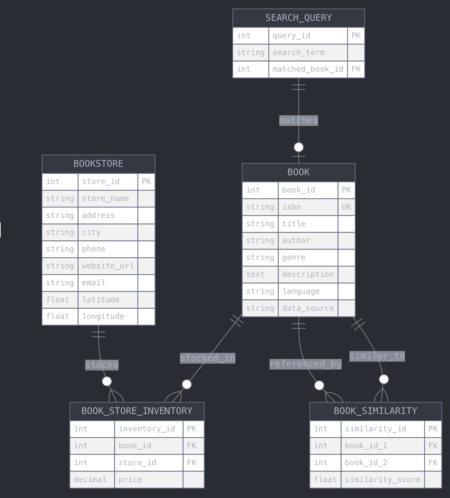
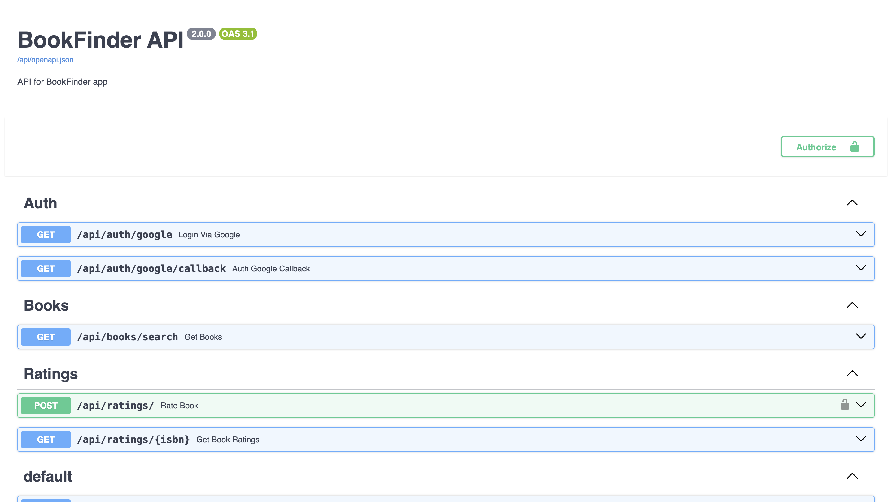
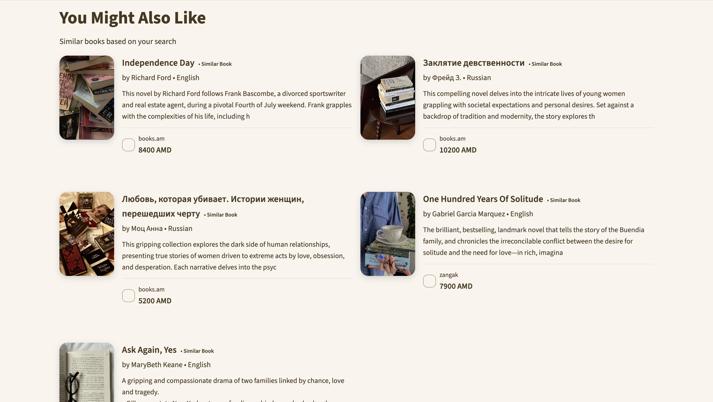

# BookFinder Deployment

This project is deployed on Azure Kubernetes Service (AKS).

You can access the different parts of the system as follows:

- **Frontend (User Interface)**  
  View the live frontend here: [https://bookfinder.swedencentral.cloudapp.azure.com](https://bookfinder.swedencentral.cloudapp.azure.com)

- **API (FastAPI backend)**  
  Access the API documentation (Swagger UI) here: [https://bookfinder.swedencentral.cloudapp.azure.com/api/docs](https://bookfinder.swedencentral.cloudapp.azure.com/api/docs)

- **PGAdmin (Database Management)**  
  Access PGAdmin here: [https://bookfinder.swedencentral.cloudapp.azure.com/pgadmin](https://bookfinder.swedencentral.cloudapp.azure.com/pgadmin) (Credentials not provided)

---

# Dockerized ETL, PostgreSQL, pgAdmin, Backend Setup, Streamlit Setup

## Branches

This repository contains the following branches:

- **main**: The primary branch containing the complete project setup.
- **gh-pages:** Deploying the documentation.

## Installation

Before getting started, ensure you have the following prerequisites installed:

1. Clone the repository:
   ```bash
   git clone hhttps://github.com/DS-223-2025-Fall/group-7.git
   cd BookFinder
   ```

2. Build and start the Docker containers:
   ```bash
   docker-compose up --build
   ```

## Access the Application

After running `docker-compose up --build`, you can access each component of the application at the following URLs:

- **Streamlit Frontend:** http://localhost:8501 The main interface for managing employees, built with Streamlit. Use this to add, view, update, and delete employee records.
- **FastAPI Backend**: [http://localhost:8008](http://localhost:8008)  
  The backend API where requests are processed. You can use tools like [Swagger UI](http://localhost:8008/api/docs) (provided by FastAPI) to explore the API endpoints and their details.

- **PgAdmin** (optional): [http://localhost:5050](http://localhost:5050)  
  A graphical tool for PostgreSQL, which allows you to view and manage the database. Login using the credentials set in the `.env` file:
  
  - **Email**: Value of `PGADMIN_EMAIL` in your `.env` file
  - **Password**: Value of `PGADMIN_PASSWORD` in your `.env` file

> Note: Ensure Docker is running, and all environment variables in `.env` are correctly configured before accessing these URLs.


## Project Structure

Here’s an overview of the project’s file structure:

```bash
.
BookFinder/
├── backend/
│   ├── app/
│   ├── Dockerfile
│   ├── requirements.txt
│   └── README.md
├── frontend/
│   ├── app.py
│   ├── components/
│   ├── Dockerfile
│   ├── requirements.txt
│   └── README.md
├── etl/
│   ├── data/
│   ├── database/
│   ├── etl_process.py
│   ├── Dockerfile
│   └── requirements.txt
├── kube/
│   └── ... (Kubernetes deployment and service files)
├── scraping/
│   └── requirements.txt
├── docker-compose.yml
├── README.md
├── docs/
└── venv/
```

## Docker 

This repository sets up a Docker environment with three main services:

1. **PostgreSQL:** for data storage
2. **pgAdmin:** for database management and visualization
3. **ETL:** service for Extract, Transform, Load operations using Python

## Prerequisites

Before running this setup, ensure Docker and Docker Compose are installed on your system.


- Docker: [Install Docker](https://docs.docker.com/get-docker/)
- Docker Compose: [Install Docker Compose](https://docs.docker.com/compose/install/)


## DB

- Access pgAdmin for PostgreSQL management: [http://localhost:5050](http://localhost:5050)
    - username: admin@admin.com 
    - password: admin
    - When running for the first time, you must create a server. Configure it as shown in the below image (Password is blurred it should be `password`.)


## ETL

### Schema Design

We will try to create below schema:



### ETL

In `models.py`, we have used `sqlalchemy` package, which allows map python objects with SQL objects.

By running `etl.py` following objects will be created:
    - sql tables 
    - the data sets will store in `data\` folder
    - the csv files will be loaded into DB

## API




## Web Application

Adding another service named app, which is going to be responsible for the frontend.

To Open the web app visit: [here](http://localhost:8501/)




